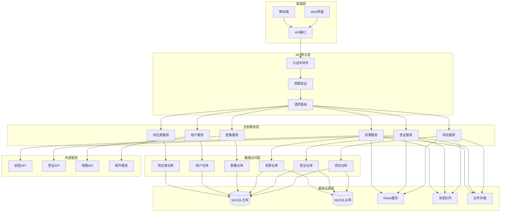

# MyTravelPanel 系统架构文档

## 项目概述

MyTravelPanel 是一个基于Flask的旅游管理系统，主要服务于旅行社业务管理。系统采用模块化设计，包含签证管理、机票预订、旅游套餐管理等核心功能。

## 系统架构图

### 改进后的目标架构



## 核心模块说明

### 前端层
- **Web界面**：基于Flask模板的传统Web界面
- **移动端**：未来扩展的移动应用接口
- **API接口**：RESTful API，支持前后端分离

### API网关层
- **认证中间件**：用户身份验证
- **权限验证**：基于角色的访问控制
- **请求路由**：智能路由分发

### 业务服务层
- **项目服务**：项目生命周期管理
- **签证服务**：签证申请流程管理
- **机票服务**：航班查询和预订
- **套餐服务**：旅游产品管理
- **用户服务**：用户账户管理
- **供应商服务**：供应商关系管理

### 数据访问层
- **仓库模式**：统一的数据访问接口
- **数据映射**：ORM对象关系映射
- **查询优化**：高效的数据库查询

### 基础设施层
- **MySQL主从**：数据持久化和读写分离
- **Redis缓存**：高速数据缓存
- **消息队列**：异步任务处理
- **文件存储**：文档和媒体文件管理

### 外部服务
- **航班API**：实时航班信息
- **签证API**：签证政策查询
- **地图API**：地理位置服务
- **邮件服务**：通知和提醒

## 技术栈

### 后端技术
- **框架**：Flask 2.x
- **数据库**：MySQL 8.0+
- **缓存**：Redis 6.0+
- **ORM**：SQLAlchemy
- **认证**：Flask-Login
- **迁移**：Flask-Migrate

### 前端技术
- **模板引擎**：Jinja2
- **样式框架**：Bootstrap 5
- **JavaScript**：原生JS + jQuery
- **图表库**：Chart.js

### 开发工具
- **版本控制**：Git
- **包管理**：pip + requirements.txt
- **测试框架**：pytest
- **代码质量**：flake8 + black

## 部署架构

### 开发环境
```
开发机 → Flask开发服务器 → SQLite/MySQL → 本地文件系统
```

### 生产环境
```
负载均衡器 → Web服务器(Nginx) → WSGI服务器(Gunicorn) → Flask应用
                                                        ↓
                                                   MySQL集群
                                                        ↓
                                                   Redis集群
```

## 安全考虑

### 数据安全
- 敏感信息环境变量管理
- 数据库连接加密
- 用户密码哈希存储

### 访问安全
- JWT令牌认证
- 基于角色的权限控制
- API访问频率限制

### 传输安全
- HTTPS强制加密
- CSRF保护
- XSS防护

## 性能优化

### 数据库优化
- 索引优化
- 查询优化
- 读写分离

### 缓存策略
- 页面缓存
- 数据缓存
- 会话缓存

### 前端优化
- 静态资源压缩
- CDN加速
- 懒加载

## 监控和日志

### 应用监控
- 性能指标监控
- 错误率监控
- 用户行为分析

### 日志管理
- 结构化日志
- 日志聚合
- 日志分析

## 扩展规划

### 短期目标
- 完善单元测试
- 优化数据库性能
- 增强安全防护

### 中期目标
- 微服务拆分
- 容器化部署
- 自动化运维

### 长期目标
- 云原生架构
- 大数据分析
- AI智能推荐
